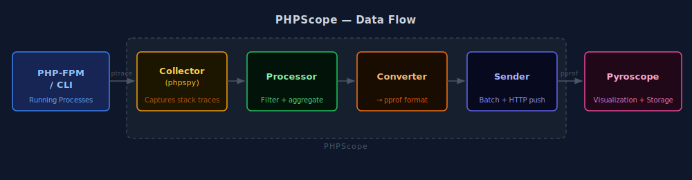

# PHPScope

[](https://vshymanskyy.github.io/StandWithUkraine/)

PHPScope is a PHP profiling tool based on [phpspy](https://github.com/adsr/phpspy) that integrates with Pyroscope to provide continuous profiling for PHP applications. It captures trought [phpspy](https://github.com/adsr/phpspy) PHP-FPM and PHP CLI processes performance data and sends it to a Pyroscope server for visualization and analysis.

## Features

- Real-time PHP process profiling
- Integration with Pyroscope
- Configurable sampling rate and batch processing
- Support for PHP-FPM and PHP CLI processes
- Customizable tags for better data organization
- Function exclusion patterns
- Concurrent processing support ( WIP )

## Architecture



The diagram above shows the main components of PHPScope:

1. **Collector (phpspy)**: Captures stack traces from PHP processes
2. **Processor**: Processes and filters the raw stack traces
3. **Converter**: Converts traces to Pyroscope-compatible format
4. **Sender**: Handles communication with Pyroscope server

## Prerequisites

- Go 1.23.3 or higher
- PHP-FPM or PHP CLI processes running ( Tested on PHP 8.3 )
- Access to a Pyroscope server
- phpspy installed on the system ( Incuded in docker container )

## Installation

You can either run PHPScope using Docker Compose or build it from source.

### Using Docker Compose

   ```shell
   curl -sSL https://raw.githubusercontent.com/everythings-gonna-be-alright/phpScope/refs/heads/main/docker-compose.yaml | docker compose -f - up -d
   ```

After installation, you can access the Pyroscope UI at:

   ```shell
   http://127.0.0.1:4040
   ```

### Building from Source

   ```shell
   git clone https://github.com/everythings-gonna-be-alright/phpscope
   cd phpscope
   go build
   ```

## Usage

Basic usage example:

   ```shell
   ./phpscope --pyroscopeUrl="http://pyroscope:4040" --appName="your-app-name"
   ```

### Command Line Options

| Option | Default | Description |
|--------|---------|-------------|
| --pyroscopeUrl | required | URL of the Pyroscope server |
| --auth | "" | Pyroscope authentication token |
| --appName | required | Application name for profiling |
| --rateHz | 400 | Sample rate in Hz |
| --interval | 0.1 | Maximum time between requests to Pyroscope server |
| --batch | 50000 | Maximum number of traces in request |
| --concurrent | 1 | Concurrent request limit |
| --exclude | "" | Regex pattern to exclude functions |
| --tags | [] | Tags in format key=value |
| --phpspyBufferSize | 131072 | phpspy buffer size |
| --phpspyMaxDepth | 50000 | phpspy max stack depth |
| --phpspyThreads | 64 | phpspy threads count |
| --debug | false | Enable debug logging |

## Example

Profile a PHP application with custom tags and exclusion pattern:

   ```shell
   ./phpscope \
     --pyroscopeUrl="http://pyroscope:4040" \
     --appName="my-php-app" \
     --tags="environment=production" \
     --tags="version=1.0" \
     --exclude="vendor/*" \
     --rateHz=100
   ```

## Contributing

Contributions are welcome! Please feel free to submit a Pull Request.

## License

This project is licensed under the MIT License - see the LICENSE file for details.
