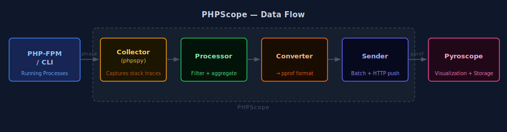

# PHPScope

[](https://vshymanskyy.github.io/StandWithUkraine/)

PHPScope is a PHP profiling tool based on [phpspy](https://github.com/adsr/phpspy) that integrates with Pyroscope to provide continuous profiling for PHP applications. It captures through [phpspy](https://github.com/adsr/phpspy) PHP-FPM and PHP CLI processes performance data and sends it to a Pyroscope server for visualization and analysis.

## Features

- Real-time PHP process profiling
- Integration with Pyroscope
- Configurable sampling rate and batch processing
- Support for PHP-FPM and PHP CLI processes
- Customizable tags for better data organization
- Function exclusion patterns
- Concurrent processing support ( WIP )

## Architecture



The diagram above shows the main components of PHPScope:

1. **Collector (phpspy)**: Captures stack traces from PHP processes
2. **Processor**: Processes and filters the raw stack traces
3. **Converter**: Converts traces to Pyroscope-compatible format
4. **Sender**: Handles communication with Pyroscope server

## Prerequisites

- Go 1.26.2 or higher
- PHP-FPM or PHP CLI processes running ( Tested on PHP 8.3 )
- Access to a Pyroscope server
- phpspy installed on the system ( Included in docker container )

## Installation

You can either run PHPScope using Docker Compose or build it from source.

### Using Docker Compose

   ```shell
   curl -sSL https://raw.githubusercontent.com/everythings-gonna-be-alright/phpScope/refs/heads/main/examples/docker-compose/docker-compose.yaml | docker compose -f - up -d
   ```

Once running, PHPScope will automatically discover and profile all PHP processes (PHP-FPM and PHP CLI) running on the host — including those inside Docker containers — and continuously stream profiling data to the bundled Pyroscope instance.

After installation, you can access the Pyroscope UI at:

   ```shell
   http://127.0.0.1:4040
   ```

### Deploying on Kubernetes (Helm)

For Kubernetes environments, the recommended approach is to run PHPScope as a **sidecar container** alongside your PHP application pod. This gives PHPScope direct access to the PHP processes within the same pod namespace without requiring host-level privileges beyond the pod boundary.

A Helm chart example is available in [`examples/helm-chart/wordpress-example`](examples/helm-chart/wordpress-example). It includes a full deployment with PHPScope as a sidecar, Pyroscope as a subchart dependency, NetworkPolicy, and all required RBAC resources.

   ```shell
   git clone https://github.com/everythings-gonna-be-alright/phpScope
   cd phpScope/

   # Install into your cluster
   helm upgrade --install wordpress-example examples/helm-chart/wordpress-example/ \
     --namespace wordpress-example \
     --create-namespace
   ```

Once installed, use port-forwarding to access the services locally:

   ```shell
   # Pyroscope UI
   kubectl port-forward -n wordpress-example svc/wordpress-example-pyroscope 4040:4040

   # WordPress
   kubectl port-forward -n wordpress-example svc/wordpress-example 8080:8080
   ```

Then open:
- Pyroscope UI: `http://localhost:4040`
- WordPress: `http://localhost:8080`

### Building from Source

   ```shell
   git clone https://github.com/everythings-gonna-be-alright/phpscope
   cd phpscope
   go build
   ```

## Usage

Basic usage example:

   ```shell
   ./phpscope --pyroscopeUrl="http://pyroscope:4040" --appName="your-app-name"
   ```

### Command Line Options

| Option              | Default                   | Description                                       |
|---------------------|---------------------------|---------------------------------------------------|
| --pyroscopeUrl      | required                  | URL of the Pyroscope server                       |
| --auth              | ""                        | Pyroscope authentication token                    |
| --appName           | required                  | Application name for profiling                    |
| --rateHz            | 400                       | Sample rate in Hz                                 |
| --interval          | 0.1                       | Maximum time between requests to Pyroscope server |
| --batch             | 50000                     | Maximum number of traces in request               |
| --concurrent        | 1                         | Concurrent request limit                          |
| --exclude           | ""                        | Regex pattern to exclude functions                |
| --tags              | []                        | Tags in format key=value                          |
| --phpspyBufferSize  | 131072                    | phpspy buffer size                                |
| --phpspyMaxDepth    | -1                        | phpspy max stack depth (-1 = unlimited)           |
| --phpspyThreads     | 64                        | phpspy threads count                              |
| --phpspyRequestInfo | qcup                      | Request info fields included in traces            |
| --pgrep             | `-x "(php-fpm.*\|^php$)"` | pgrep pattern for finding PHP processes           |
| --debug             | false                     | Enable debug logging                              |

## Example

Profile a PHP application with custom tags and exclusion pattern:

   ```shell
   ./phpscope \
     --pyroscopeUrl="http://pyroscope:4040" \
     --appName="my-php-app" \
     --tags="environment=production" \
     --tags="version=1.0" \
     --exclude="vendor/*" \
     --rateHz=100
   ```

## Contributing

Contributions are welcome! Please feel free to submit a Pull Request.

## License

This project is licensed under the MIT License - see the LICENSE file for details.
